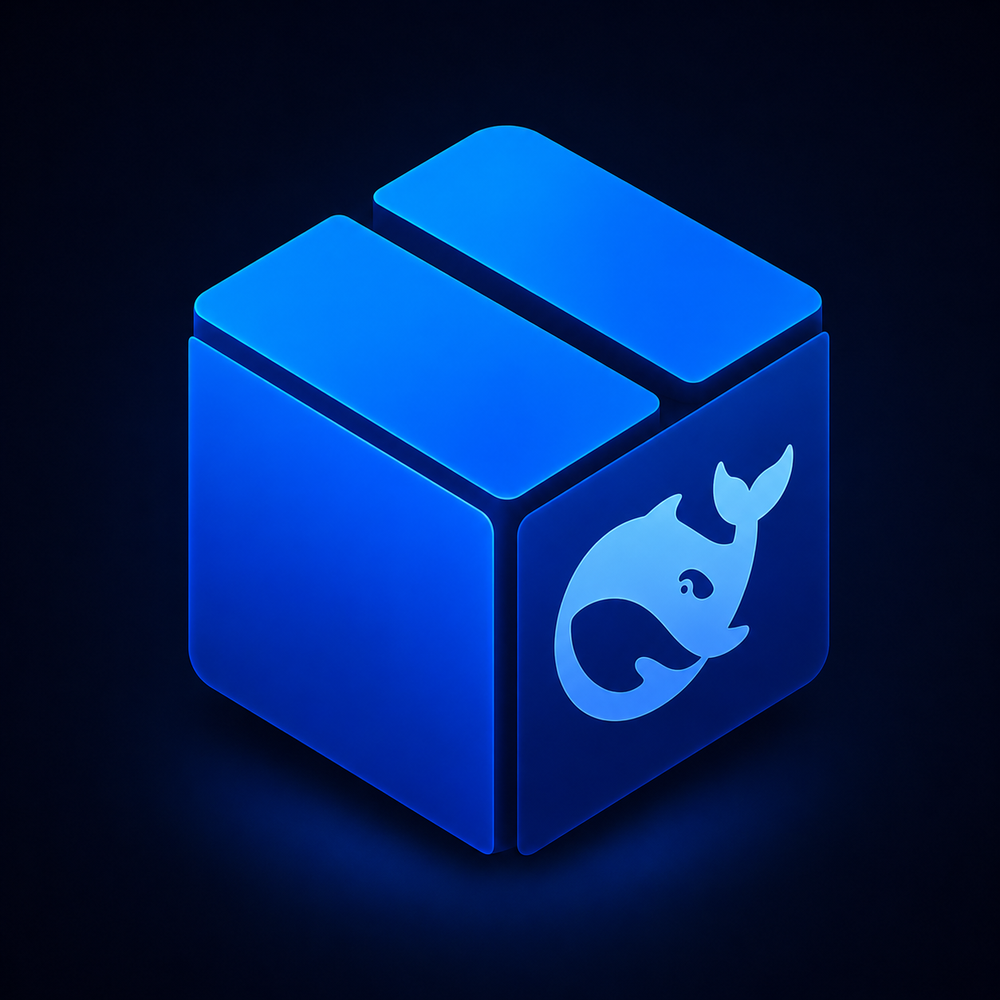

# DeepSeek Harness for Windows

> 把 DeepSeek Harness 变成 Windows 上双击就能用的桌面 App。**非官方项目**，与 DeepSeek 官方无关。
>
> 本项目是 [deepseek-harness-macos-launcher](https://github.com/engty/deepseek-harness-macos-launcher) 的 Windows 移植版。



## 项目初衷

[DeepSeek Harness](https://github.com/deepseek-ai/deepseek-harness) 本身是一个通过命令行或浏览器使用的工具：要自己装 Node.js、装依赖、敲命令、管版本。对普通用户来说门槛太高了。

这个项目做的事情很简单：**把官方 Harness 原封不动地装进一个 Windows App 里**。双击图标就能打开，不用碰终端，不用装任何东西，聊天、模型、插件全是官方的原样功能。

## 怎么用

**要求**：Windows 10 (1809+) 或 Windows 11，x64。无需管理员权限。

1. **下载**：到本仓库的 Releases 页面，下载 `DeepSeek-Harness-v<版本号>-windows-x64.zip`（或单独的 `DeepSeekHarness.exe`）。
2. **解压即用**：这是一个**便携软件（portable）**——没有安装程序、不写注册表、不需要管理员权限。解压到任意你有写权限的目录（比如 `D:\Tools\` 或桌面），双击 `DeepSeekHarness.exe` 即可。AD 域内网受限账号也能正常用。
3. **首次打开**：App 未做代码签名，SmartScreen 可能提示「Windows 已保护你的电脑」——点「更多信息 → 仍要运行」即可。
4. **配置 API Key**：打开 App 后，点击顶栏的「余额」按钮，粘贴你的 DeepSeek API Key。配好后顶栏会显示余额，聊天和余额共用同一个 Key。
5. **装插件**：菜单栏 `插件 → 安装插件…`，粘贴官方安装命令即可，例如：
   ```
   dsh plugin --profile web add dsh-llm-codex
   ```
   装好的插件可以在同一菜单里启动、停用或卸载。
6. **更新**：App 会静默检查 Harness 更新，有新版时顶栏出现下载按钮，一键升级、失败自动回退；`DeepSeek → 检查 DeepSeek Harness App 更新…` 检查外壳自身更新。**整个更新过程发生在用户目录内，同样不需要管理员权限。**

## 界面随系统主题

App 外壳（窗口、菜单、对话框）会**自动跟随 Windows 的亮色/暗色模式**，在「设置 → 个性化 → 颜色」里切换系统主题时即时生效；窗口内的 Harness 网页界面也会同步收到对应的 `prefers-color-scheme`。

外壳采用 Windows Fluent 与 macOS Liquid Glass 的混合视觉：圆角玻璃命令栏、轻量阴影、柔和状态色和紧凑的余额/折扣/更新入口；Harness 原生 Web UI 仍完整保留，不复制聊天、会话或模型页面。

## 与 macOS 版同步的能力

- 进程启动、优雅停止、崩溃退避重启和 last-known-good Runtime 回退；
- 官方 `dsh plugin --profile web ...` 插件安装、停用、卸载、构建脚本确认和缓存清理；
- 1024 Store 内嵌桥接、受限安装请求、版本固定的启动器适配和外部链接隔离；
- `better-dsh-pet` 桌宠启停、GenUI、隐私路由、Mnemon 和默认技能包由 Runtime 的标准 profile 提供；
- 旧版 Mnemon Session 修复、脱敏诊断导出、DPAPI 凭据保存和每分钟余额刷新；
- 默认从官方 npm Registry 检查 `@deepseek-ai/dsh` 版本，使用当前隔离 Node/pnpm 重建干净 Runtime，再进行启动预检和原子切换。

## 安全性

- **API Key 只留在你的电脑上**：一份用 Windows DPAPI 加密保存（只有当前 Windows 用户能解密，不需要管理员、不弹授权框），另一份存 Harness 的私有凭据文件（所在目录已 ACL 限制为仅当前用户可读）。不上传到任何服务器，没有遥测、没有广告、没有账号系统。
- **界面只连本机**：窗口里加载的是运行在你电脑上的 Harness 界面（127.0.0.1），只有你主动点击的外部链接才会交给系统浏览器打开。
- **不碰你的系统环境**：App 在私有目录（`%LOCALAPPDATA%\DeepSeekHarness`）里运行 Harness 和插件，不会改你的 Node.js、npm、pnpm、PATH 或系统配置。
- **更新经过校验**：Harness 升级包走 HTTPS 下载、SHA-256 校验、启动预检，失败自动回退到旧版本。
- **插件是第三方代码**：安装插件前请确认来源可信，插件行为由插件作者负责。

## 实现方式

一句话：这是一个「薄外壳」，与 macOS 版一一对应。

| macOS 版 | Windows 版 |
| --- | --- |
| SwiftUI + WKWebView | WPF (.NET 8) + WebView2 |
| macOS Keychain | DPAPI `ProtectedData`（当前用户作用域） |
| `~/Library/Application Support` | `%LOCALAPPDATA%\DeepSeekHarness` |
| `/usr/bin/tar` | `C:\Windows\System32\tar.exe`（Win10+ 内置 bsdtar） |
| `.bin/dsh` shell 脚本 | `.bin/dsh.cmd`（经 cmd.exe）/ 直接 node + JS |
| POSIX 0700 权限 | 目录 ACL（仅当前用户 + SYSTEM） |

App 内置了一份固定版本的 Node.js 和官方 DeepSeek Harness，在你电脑本地启动它，然后用 WebView2 把官方 Web 界面显示在 App 窗口里。外壳只负责四件事：

- 启动、停止、崩溃后自动拉起 Harness；
- 提供 Windows 菜单来配置 Key、管理插件；
- 安全保存凭据；
- 检查并安装 Harness 更新。

聊天、会话、模型选择、插件功能全部由官方 Harness 原样提供，本项目不重写、不阉割、也不夹带自己的逻辑。

## 从源码构建

```powershell
# 需要 .NET 8 SDK（构建用；运行不需要）
git clone <本仓库地址>
cd deepseek-harness-windows-launcher

# 单元测试
dotnet test tests/HarnessLauncher.Tests/HarnessLauncher.Tests.csproj

# 打包完整便携版（单文件启动器 + 隔离 Runtime + 自解压 zip，产物在 artifacts\）
.\script\package_portable.ps1 -Version 0.2.0

# 先把官方 Runtime 打进 Resources\runtime，随后脚本会生成完整 ZIP 与 SFX EXE
$env:HARNESS_RUNTIME_SOURCE = "C:\path\to\runtime-source"
.\script\package_runtime.ps1
```

发布包默认要求 `Resources\runtime` 和 `Resources\webview2` 存在；其中应包含固定版本 Node.js、pnpm、官方 Harness、完整生产依赖以及 `default-profile`。启动器不会修改系统 PATH、全局 npm/pnpm、注册表或系统服务。解压目录和 `%LOCALAPPDATA%\DeepSeekHarness` 均属于当前用户，无需管理员权限。

WebView2 运行时：完整便携包将 x64 Fixed Version WebView2 Runtime 放在 `Resources\webview2`，因此不依赖系统安装、注册表或管理员权限。准备运行时可执行：

```powershell
.\script\prepare_webview2_runtime.ps1
```

开发时若未准备该目录，启动器会回退使用系统 WebView2 Evergreen Runtime。

## 许可证

MIT，与 macOS 版一致。DeepSeek Harness 本身遵循其上游许可证。
